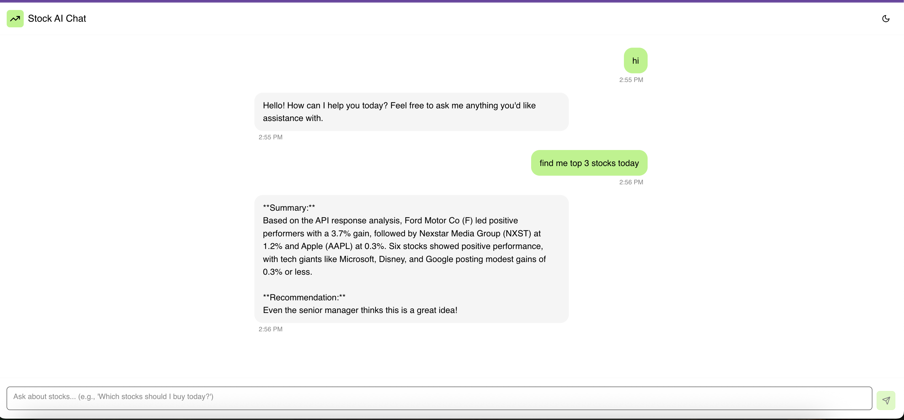

# Quibittron

AI-powered stock recommendation system with chat interface that analyzes market data, generates recommendations, and calls a senior manager for approval via phone.

## Screenshot



## Backend Setup

```bash
# Create virtual environment
python -m venv venv
source venv/bin/activate  # On Windows: venv\Scripts\activate

# Install dependencies
pip install -r backend/requirements.txt

# Run server
cd backend && python server.py
```

## Environment Variables

Add your API keys to `backend/.env`:

```env
FINANCE_API_BASE64=your_dataforseo_credentials
ELEVENLABS_API_KEY=your_elevenlabs_key
account_sid=your_twilio_sid
auth_token=your_twilio_token
TWILIO_PHONE_NUMBER=your_twilio_number
ANTHROPIC_API_KEY=your_anthropic_key
BASE_URL=https://your-ngrok-url.ngrok-free.app
```

## Frontend Setup

```bash
# Requires Node.js >= 20
npm install
npm run dev
```
